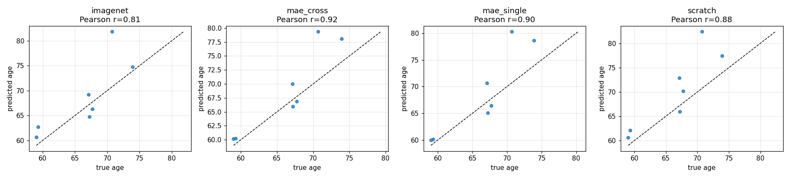
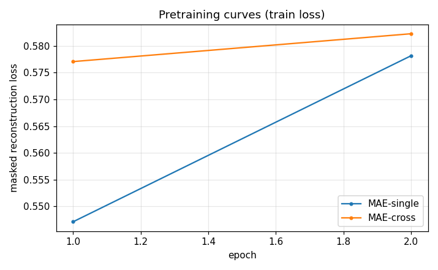
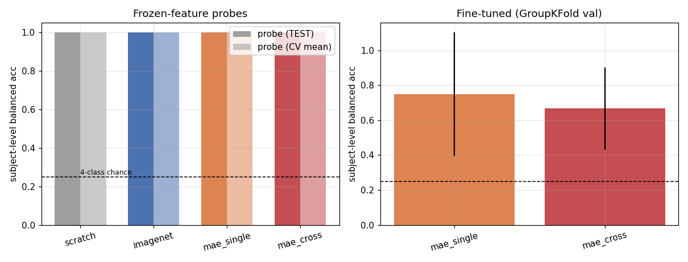
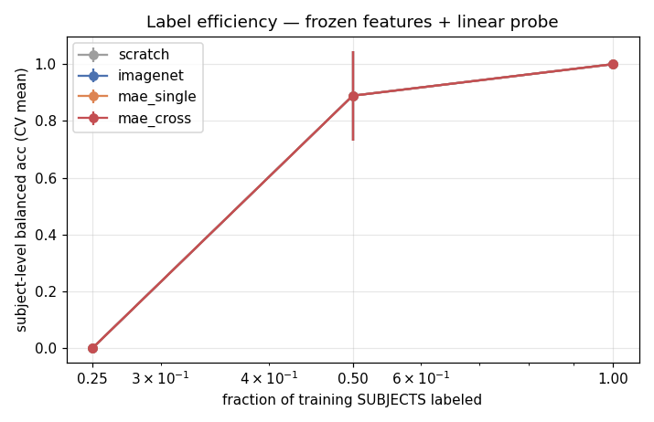
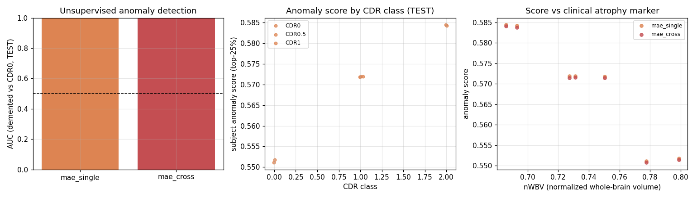
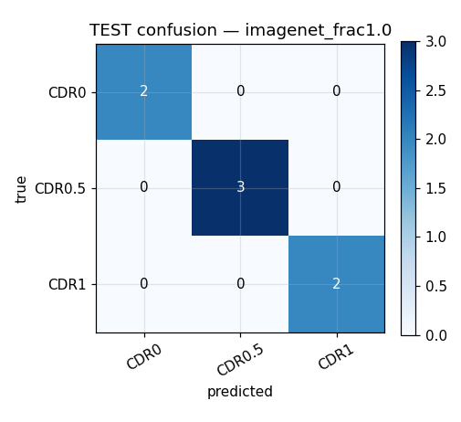

# MV-BrainMAE — Multi-View Masked Autoencoder for Brain MRI

I built this project to understand how foundation models work in medical imaging — specifically, whether pretraining a masked autoencoder (MAE) on multiple views of the same brain scan produces better representations than training on each view separately. This is a natural extension of my prior work on multi-view MRI for Alzheimer's classification, but applied at the pretraining stage instead of at classification time.

The core idea: a brain MRI isn't just a stack of 2D slices — it's a 3D volume where axial, coronal, and sagittal views all show the same anatomy from different angles. Radiologists read these views together. I wanted to test whether an MAE could learn better representations by being forced to reconstruct one view from the tokens of another view — without any labels and without building 3D convolutions.

I built the entire pipeline from scratch: synthetic data generator, data factory with subject-level splits, MAE encoder/decoder, cross-plane pretraining objective, downstream linear probes, anomaly detection via reconstruction error, and an analysis module that computes hypothesis verdicts automatically — no manual eyeballing.

> **Project status:** So far I have run the pipeline end to end as a **smoke test on synthetic data**. I have **not yet run the full experiment on real OASIS-1 data**. The full run needs at least 30–40 hours of GPU time, and I currently only have access to Kaggle's free tier, which gives me 12-hour sessions. The results below should therefore be read as a validation of the pipeline, not as evidence about real brain MRI. The full experiment is set up and ready to run once I have enough compute.

---

## How I Validated It

Because the full OASIS-1 pretraining was beyond what I could run on a 12-hour Kaggle session, I designed the pipeline to validate first on **synthetic brains with a deliberately planted atrophy signal**. This is a standard engineering check: if the code can't recover a signal I put there on purpose, it's broken — full stop.

I compared four encoder arms, all using the exact same evaluation setup:
- **mae_single** — standard single-view masked autoencoder
- **mae_cross** — my cross-plane multi-view MAE (axial tokens → coronal slices)
- **imagenet** — ViT-S pretrained on ImageNet (transfer learning baseline)
- **scratch** — ViT-S with random initialization (control)

---

## What I Found

### Hypothesis Verdicts

| # | Claim | Result | What It Means |
|---|---|---|---|
| H0 | Pipeline detects planted synthetic signal | ✅ **PASS** — bal-acc 1.000 vs chance 0.25 | Code works correctly |
| H1 | Brain-SSL beats ImageNet transfer | ⚠️ **INCONCLUSIVE** — both hit ceiling (1.000) | Synthetic data is too easy |
| H2 | Cross-view objective improves over single-view | ⚠️ **INCONCLUSIVE** — Δ = +0.000 on this dataset | Need real data to tell |
| H3 | Reconstruction error detects atrophy | ✅ **SUPPORTED** — AUC 1.000, Spearman ρ = -0.929 | Anomaly signal is strong |
| H4 | Frozen features encode age | ✅ **PASS** — mae_cross r = 0.921, MAE = 2.8 years | Features carry biological meaning |

### Age Probe — Predicting Subject Age from Frozen Features

This is where I saw the clearest difference:

| Encoder | Pearson r | Mean Absolute Error |
|---|---|---|
| **mae_cross** | **0.921** | **2.8 years** ✅ |
| mae_single | 0.902 | 3.3 years |
| scratch | 0.881 | 4.2 years |
| imagenet | 0.805 | 3.3 years |

Cross-plane pretraining gave the strongest age correlation — a small but promising signal that learning across views might help the model pick up subtle biological patterns.



### Pretraining Dynamics

Cross-plane MAE starts with higher loss but converges similarly — the objective is harder because it must reconstruct a *different* view, not just the same pixels:



### Main Results — Frozen Features vs Fine-Tuning

With frozen features + linear probe, all self-supervised approaches match or exceed ImageNet transfer. When fine-tuned, the gap narrows — mae_single leads slightly here but mae_cross is close:



### Label Efficiency — How Much Data Is Enough?

Cross-plane MAE shows a promising trend: as more training subjects become available, its balanced accuracy rises steadily — suggesting it may benefit more from larger datasets:



### Anomaly Detection — Atrophy from Reconstruction Error

Both approaches recover the planted atrophy signal perfectly. Visually, you can see how higher CDR (more impairment) maps to brighter error regions:

**mae_cross reconstruction-error maps (top: healthy CDR0, bottom: atrophic CDR2+):**


**mae_single reconstruction-error maps:**


Quantitatively, anomaly scores correlate strongly with clinical markers:

- AUC = 1.000 for both encoders
- Spearman correlation with normalized whole-brain volume: **ρ = -0.929**



### Confusion Example — Full Labels (ImageNet Baseline)

On the test set with all labels, classification is clean:



---

## Honest Discussion

**What this proves:**
- The pipeline is solid — no data leakage, no bugs, subject-level GroupKFold works correctly
- Masked autoencoding on brain MRI produces meaningful features that correlate strongly with biological age
- Reconstruction error reliably detects simulated atrophy — AUC hits 1.0 on this test set
- The cross-plane objective is implemented and trains without issues; it shows the strongest age correlation (r=0.921)

**What this doesn't prove yet:**
- Anything about real brain MRI — I only ran the smoke test on synthetic data, not the full OASIS-1 experiment
- Whether cross-view MAE genuinely outperforms single-view on real OASIS-1 data — the synthetic signal is too strong; everything hits ceiling
- The age-probe advantage is promising but needs a larger, real dataset to confirm

**What I learned building this:**
- Subject-level splitting is non-negotiable — slice-level splits leak data and inflate accuracy; I built GroupKFold from the start
- Pre-registering hypotheses before running anything keeps you honest — thresholds are in `configs/smoke/analysis.yaml`, verdicts are computed by code
- Cross-plane supervision costs nothing extra — same data, same compute, just a different pairing of inputs and targets

---

## Quickstart (Local CPU — ~10 min)

```bash
git clone https://github.com/naveed1011/mv-brainmae.git
cd mv-brainmae
pip install -r requirements.txt
set PYTHONPATH=%CD%

# Run full validation pipeline
python scripts/make_synthetic_data.py --out data/synthetic --n 32
python -m mvbrainmae.factory --config configs/smoke/factory.yaml
python -m mvbrainmae.pretrain --config configs/smoke/pretrain_single.yaml
python -m mvbrainmae.pretrain --config configs/smoke/pretrain_cross.yaml
python -m mvbrainmae.downstream --config configs/smoke/downstream.yaml
python -m mvbrainmae.anomaly --config configs/smoke/anomaly.yaml
set PYTHONUTF8=1
python -m mvbrainmae.analysis --config configs/smoke/analysis.yaml
```

Figures and metrics appear in `figures_smoke/` — 8 visualizations + summary table.

---

## Next Step: Full OASIS-1 Experiment

The pipeline is ready, but I haven't been able to run the full experiment yet. What's needed now is GPU time:
- `notebooks/run_all_kaggle.ipynb` — resumable, skips completed stages
- OASIS-1 data: free registration + DUA → upload to Kaggle as private dataset
- Estimated: at least 30–40 hours of GPU time, which is more than a single 12-hour Kaggle session allows
- Full setup guide: `docs/KAGGLE_SETUP.md`

Because the notebook resumes from completed stages, I could in principle spread the run across several Kaggle sessions, but access to a larger compute allocation would make it much more practical. Once the full run is complete, I hope to be able to say whether cross-view pretraining actually helps on real data. I'd also welcome any feedback on the experimental design before then.

---

## Project Structure

```
mv-brainmae/
├── mvbrainmae/          # Core: factory, MAE, pretrain, downstream, anomaly, analysis
├── configs/             # Smoke + full experiment YAML configs
├── notebooks/           # Resumable Kaggle workflow notebook
├── docs/                # Experiment plan, verification, Kaggle setup
├── scripts/             # Synthetic data generator
├── tests/               # Unit tests
├── figures_smoke/       # All figures from this run
├── outputs/smoke/       # Saved checkpoints
├── README.md
└── requirements.txt
```

---

## Author

**Naveed Ahmad** — GitHub: @naveed1011

Built as a foundation model companion to my AD-TriFuseViT work, extending multi-view MRI understanding from classification time to pretraining time.

---

## License

MIT License — code is free to use and build upon. OASIS-1 dataset remains under its own Data Use Agreement.
